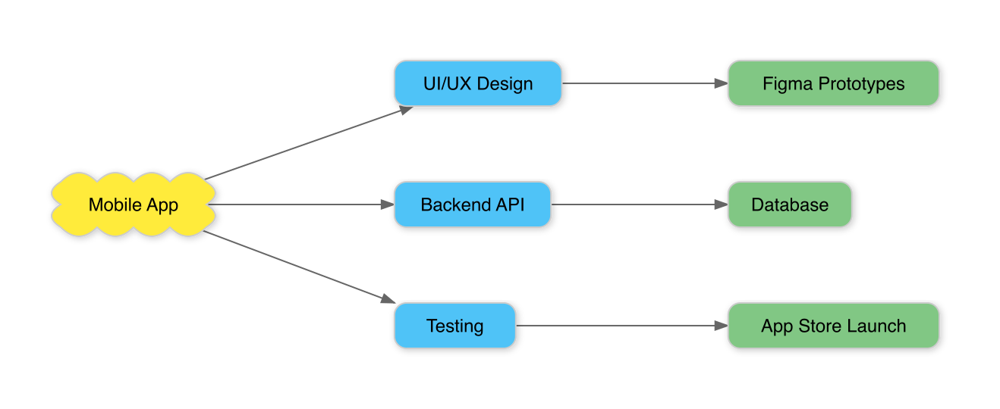
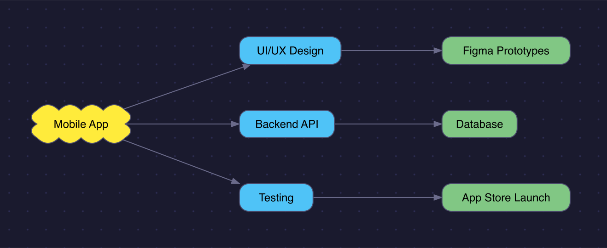

# mcp-scapple

[](https://www.npmjs.com/package/@binaryloader/mcp-scapple)

An MCP (Model Context Protocol) server for reading, writing, and rendering [Scapple](https://www.literatureandlatte.com/scapple/overview) (.scap) files. Scapple is a brainstorming tool by Literature & Latte that stores diagrams as XML. This server enables AI assistants to work with Scapple files directly.

## Features

- **read-scapple**: Parse a .scap file into structured JSON with notes, background shapes, note styles, and connections
- **write-scapple**: Create a .scap file from structured note data with automatic bidirectional connection management
- **text-to-scapple**: Convert indented text, bullet lists, or numbered lists into Scapple diagrams with automatic layout and optional themed rendering
- **scapple-to-image**: Render a .scap file to PNG with full theme support (background, colors, fonts, shadows, patterns)

## Examples

You can use natural language to create and render diagrams:

> "Make a brainstorm diagram about mobile app development with branches for design, backend, and testing"



> "Render that diagram with a dark theme — navy background, dot pattern, no shadows"



### Theme Options

The `scapple-to-image` and `text-to-scapple` tools accept an optional `theme` parameter with the following properties. All properties are optional — when omitted, values from the `.scap` file's settings are used first, then the defaults below.

#### Canvas

| Property | Type | Default | Description |
|---|---|---|---|
| `backgroundColor` | string | `#ffffff` | Canvas background color (hex) |
| `backgroundPattern` | string | `none` | Pattern type: `none`, `dots`, `grid`, `lines` |
| `patternColor` | string | `#cccccc` | Pattern color (hex) |

#### Notes

| Property | Type | Default | Description |
|---|---|---|---|
| `strokeColor` | string | `#cccccc` | Note border color (hex) |
| `strokeWidth` | number | `1` | Note border width |
| `borderRadius` | number | `8` | Rounded note corner radius |
| `shadowColor` | string | `#00000033` | Shadow color (hex with alpha) |
| `shadowEnabled` | boolean | `true` | Enable/disable shadow |
| `defaultFill` | string | `none` | Default note fill color (hex) |
| `defaultBorder` | string | `None` | Default border style: `Rounded`, `Square`, `Cloud`, `None` |

#### Text

| Property | Type | Default | Description |
|---|---|---|---|
| `defaultFont` | string | `Helvetica` | Default font family |
| `defaultFontSize` | number | `12` | Default font size |
| `defaultTextColor` | string | `#000000` | Default text color (hex) |
| `defaultAlignment` | string | `Center` | Default text alignment: `Left`, `Center`, `Right` |
| `noteXPadding` | number | `8` | Horizontal padding inside notes |

#### Connections

| Property | Type | Default | Description |
|---|---|---|---|
| `lineColor` | string | `#666666` | Connection line color (hex) |
| `lineWidth` | number | `1` | Connection line width |
| `arrowColor` | string | `#666666` | Arrow color (hex) |

### Scapple File Settings

When rendering a `.scap` file, the following settings are read from the file and used as theme defaults (overridden by explicit `theme` parameters):

- `BackgroundColor` → `backgroundColor`
- `DefaultTextColor` → `defaultTextColor`
- `DefaultFont` (UISettings) → `defaultFont`
- `NoteXPadding` (UISettings) → `noteXPadding`

Per-note appearance settings (border color, weight, text color, fill, font, bold/italic) always take precedence over theme defaults.

## Components

| Path | Description |
|---|---|
| `src/index.ts` | MCP server entrypoint |
| `src/types.ts` | TypeScript type definitions |
| `src/errors.ts` | Custom error class hierarchy |
| `src/lib/parser.ts` | .scap XML to ScappleDocument parser |
| `src/lib/builder.ts` | ScappleDocument to .scap XML builder |
| `src/lib/renderer.ts` | SVG/PNG rendering pipeline |
| `src/lib/layout.ts` | Text-to-diagram automatic layout |
| `src/lib/svg/` | SVG generation modules (shapes, connections, text, defs) |
| `src/tools/` | MCP tool handlers |
| `examples/` | Rendered samples |

## Requirements

- Node.js 18+
- npm

## Usage

### Configure in Claude Code

```bash
claude mcp add --transport stdio --scope user scapple -- npx -y @binaryloader/mcp-scapple
```

### 4. Tool Usage

**read-scapple** — Read a Scapple file:
```
filePath: "/path/to/diagram.scap"
```

**write-scapple** — Create a Scapple file:
```
filePath: "/path/to/output.scap"
document: { notes: [{ x: 100, y: 100, text: "Hello" }] }
```

**text-to-scapple** — Convert text to diagram:
```
text: "Root Topic\n  Branch A\n    Leaf 1\n  Branch B"
filePath: "/path/to/output.scap"
renderImage: true
```

**scapple-to-image** — Render to PNG:
```
filePath: "/path/to/diagram.scap"
scale: 2
theme: { backgroundColor: "#1a1a2e", backgroundPattern: "dots", shadowEnabled: false }
```

## License

This project is licensed under the MIT License - see the [LICENSE](LICENSE) file for details.
