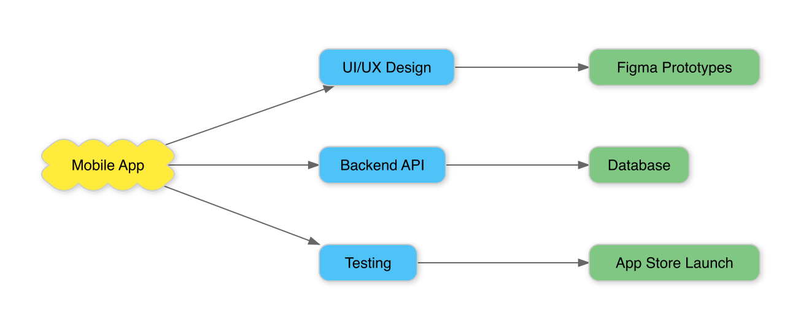
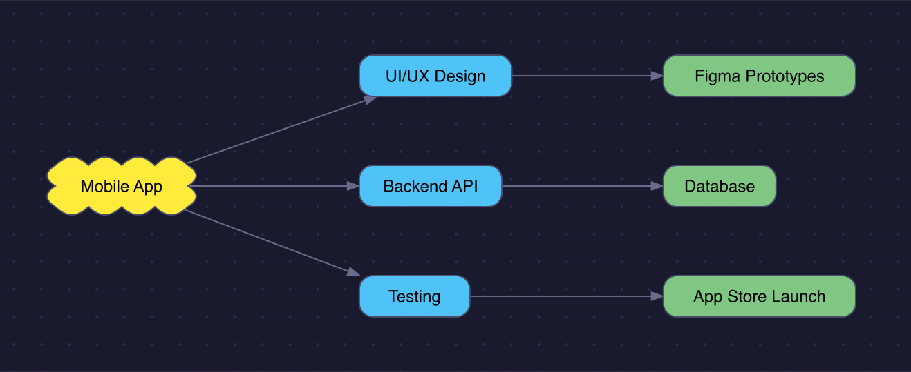

[English](../../../README.md) | [한국어](../ko/README.md) | **日本語**

# mcp-scapple

[](https://www.npmjs.com/package/@binaryloader/mcp-scapple)

[Scapple](https://www.literatureandlatte.com/scapple/overview)(.scap)ファイルの読み込み、書き込み、レンダリングを行うMCP(Model Context Protocol)サーバーです。ScappleはLiterature & Latteによるブレインストーミングツールで、ダイアグラムをXML形式で保存します。本サーバーはAIアシスタントがScappleファイルを直接扱えるようにします。

## Features

- **read-scapple**：.scapファイルを、ノート、背景図形、ノートスタイル、接続情報を含む構造化JSONにパースします
- **write-scapple**：構造化されたノートデータから.scapファイルを生成し、双方向の接続を自動的に管理します
- **text-to-scapple**：インデント付きテキスト、箇条書き、番号付きリストをScappleダイアグラムに変換し、自動レイアウトと任意のテーマレンダリングをサポートします
- **scapple-to-image**：.scapファイルをPNGにレンダリングし、背景、色、フォント、影、パターンなど完全なテーマ指定をサポートします

## Examples

自然言語でダイアグラムを作成、レンダリングできます。

> "デザイン、バックエンド、テストの枝を持つモバイルアプリ開発のブレインストーミングダイアグラムを作って"



> "そのダイアグラムをダークテーマでレンダリングして - ネイビーの背景、ドットパターン、影なし"



### Theme Options

`scapple-to-image`と`text-to-scapple`ツールはオプションの`theme`パラメータを受け取り、以下のプロパティをサポートします。すべてのプロパティは任意です。省略した場合は、まず`.scap`ファイルの設定値が使われ、それも無い場合は下記のデフォルト値が使われます。

#### Canvas

| プロパティ | 型 | デフォルト | 説明 |
|---|---|---|---|
| `backgroundColor` | string | `#ffffff` | キャンバス背景色(hex) |
| `backgroundPattern` | string | `none` | パターン種別：`none`、`dots`、`grid`、`lines` |
| `patternColor` | string | `#cccccc` | パターン色(hex) |

#### Notes

| プロパティ | 型 | デフォルト | 説明 |
|---|---|---|---|
| `strokeColor` | string | `#cccccc` | ノート枠線色(hex) |
| `strokeWidth` | number | `1` | ノート枠線の太さ |
| `borderRadius` | number | `8` | 角丸ノートのコーナー半径 |
| `shadowColor` | string | `#00000033` | 影の色(アルファ付きhex) |
| `shadowEnabled` | boolean | `true` | 影の有効・無効 |
| `defaultFill` | string | `none` | ノートのデフォルト塗りつぶし色(hex) |
| `defaultBorder` | string | `None` | デフォルトの枠線スタイル：`Rounded`、`Square`、`Cloud`、`None` |

#### Text

| プロパティ | 型 | デフォルト | 説明 |
|---|---|---|---|
| `defaultFont` | string | `Helvetica` | デフォルトのフォントファミリー |
| `defaultFontSize` | number | `12` | デフォルトのフォントサイズ |
| `defaultTextColor` | string | `#000000` | デフォルトのテキスト色(hex) |
| `defaultAlignment` | string | `Center` | デフォルトのテキスト配置：`Left`、`Center`、`Right` |
| `noteXPadding` | number | `8` | ノート内部の横方向パディング |

#### Connections

| プロパティ | 型 | デフォルト | 説明 |
|---|---|---|---|
| `lineColor` | string | `#666666` | 接続線の色(hex) |
| `lineWidth` | number | `1` | 接続線の太さ |
| `arrowColor` | string | `#666666` | 矢印の色(hex) |

### Scapple File Settings

`.scap`ファイルをレンダリングする際、ファイル内の以下の設定値が読み込まれ、テーマのデフォルト値として使われます(明示的な`theme`パラメータが指定された場合はそちらが優先されます)。

- `BackgroundColor` → `backgroundColor`
- `DefaultTextColor` → `defaultTextColor`
- `DefaultFont`(UISettings) → `defaultFont`
- `NoteXPadding`(UISettings) → `noteXPadding`

ノートごとの外観設定(枠線色、太さ、テキスト色、塗りつぶし、フォント、太字・斜体)は常にテーマのデフォルト値より優先して適用されます。

## Components

| パス | 説明 |
|---|---|
| `src/index.ts` | MCPサーバーのエントリポイント |
| `src/types.ts` | TypeScript型定義 |
| `src/errors.ts` | カスタムエラークラスの階層 |
| `src/lib/parser.ts` | .scap XMLをScappleDocumentに変換するパーサー |
| `src/lib/builder.ts` | ScappleDocumentを.scap XMLに変換するビルダー |
| `src/lib/renderer.ts` | SVG/PNGレンダリングパイプライン |
| `src/lib/layout.ts` | テキストからダイアグラムへの自動レイアウト |
| `src/lib/svg/` | SVG生成モジュール(図形、接続、テキスト、defs) |
| `src/tools/` | MCPツールハンドラー |
| `examples/` | レンダリングサンプル |

## Requirements

- Node.js 18+
- npm

## Usage

### Configure in Claude Code

```bash
claude mcp add --transport stdio --scope user scapple -- npx -y @binaryloader/mcp-scapple
```

### Tool Usage

**read-scapple** - Scappleファイルを読み込む：
```
filePath: "/path/to/diagram.scap"
```

**write-scapple** - Scappleファイルを作成する：
```
filePath: "/path/to/output.scap"
document: { notes: [{ x: 100, y: 100, text: "Hello" }] }
```

**text-to-scapple** - テキストをダイアグラムに変換する：
```
text: "Root Topic\n  Branch A\n    Leaf 1\n  Branch B"
filePath: "/path/to/output.scap"
renderImage: true
```

**scapple-to-image** - PNGにレンダリングする：
```
filePath: "/path/to/diagram.scap"
scale: 2
theme: { backgroundColor: "#1a1a2e", backgroundPattern: "dots", shadowEnabled: false }
```

## License

This project is licensed under the MIT License - see the [LICENSE](../../../LICENSE) file for details.
